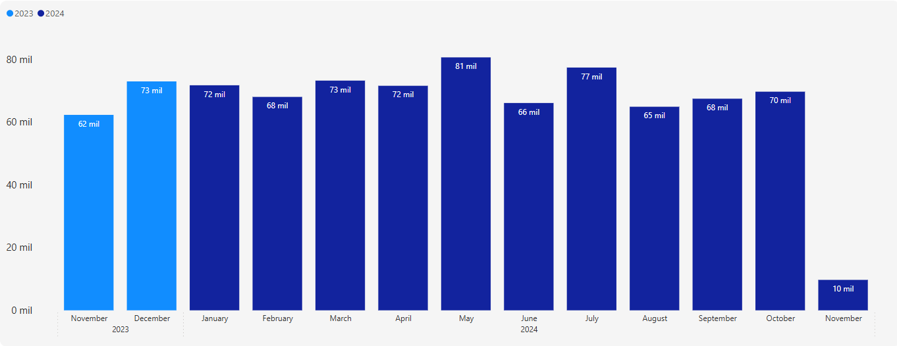
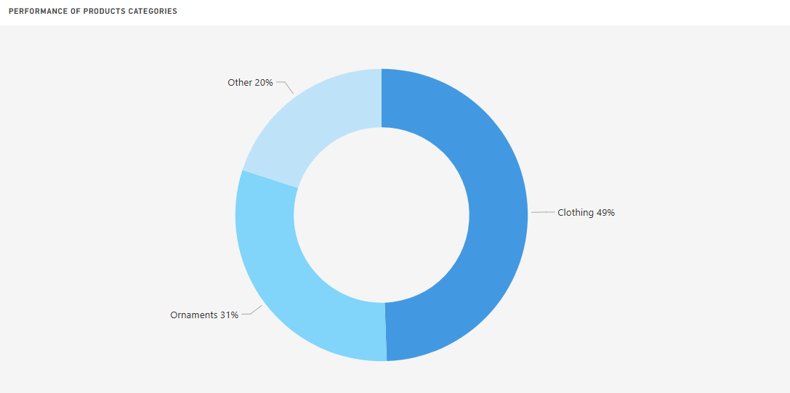
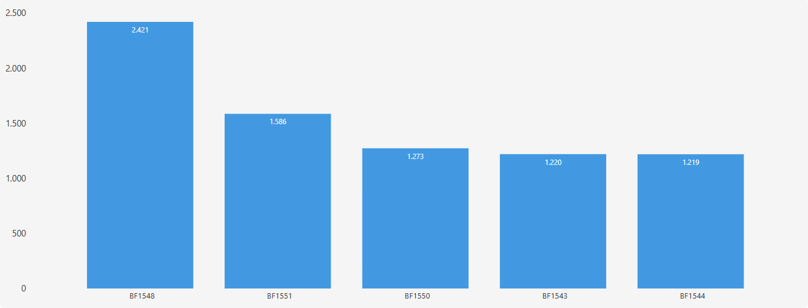
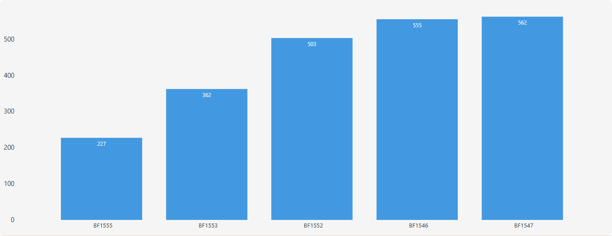
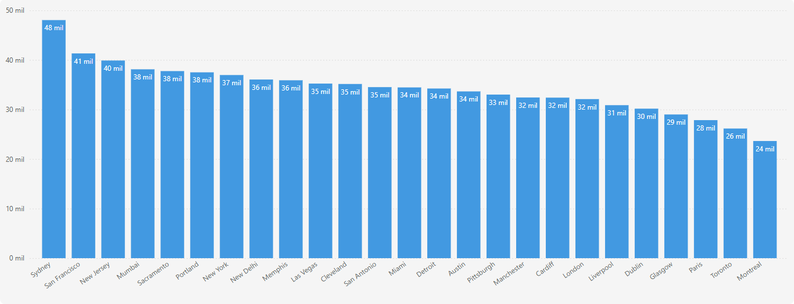
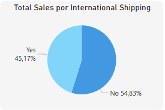
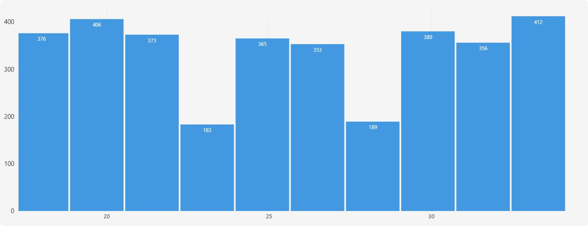
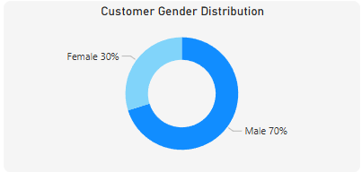
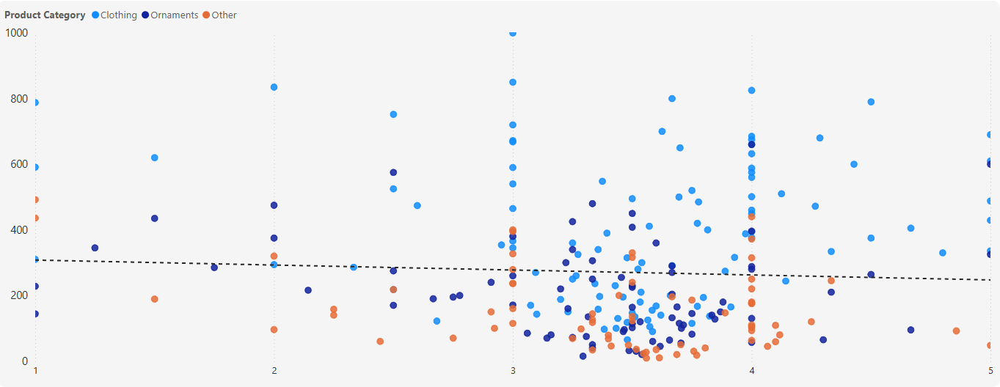
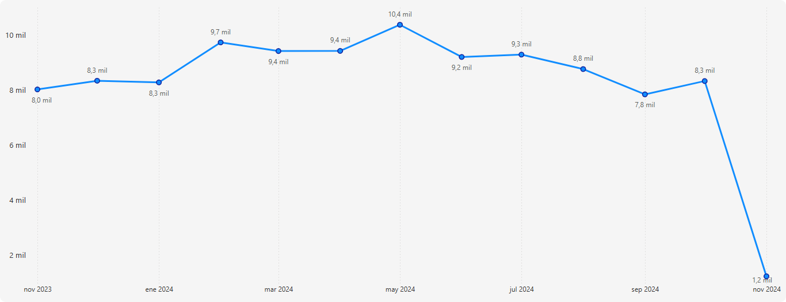

# Merchadise Sales Analysis

## Tools used

- Python: For EDA and Answer questions.
- Power Bi: For data visualization.

### Case statment
Lee Chatmen is a popular influencer from the United States with over 7 million TikTok followers. He became famous for his entertaining videos, where he plays popular songs on miniature guitars. In 2023, Lee launched his own line of merchandise. This analysis looks at how his merchandise sales are going and what we can learn from the data.

Live Dashboard: [Open here](https://app.powerbi.com/view?r=eyJrIjoiYzIwMjliZmEtNDNhYi00ZmIwLTk3MmQtN2ZhMjFlNTBjYWM5IiwidCI6ImRmODY3OWNkLWE4MGUtNDVkOC05OWFjLWM4M2VkN2ZmOTVhMCJ9&pageName=b501a8486b909b36517d)

### Answers

1.	What are the overall sales trends?
    

2.	Which product categories perform the best? 
    

3.	What are the most and least popular products?
  The most popular products are:
    
  The least popopular products are:
    
4.	How does location affect sales performance? 
    
5.	What impact does international shipping have on sales?
    
6.	What is the demographic profile of buyers?
  Age of buyers: 
  
  Gender of buyers:
  
7.	How do ratings and reviews correlate with sales? 
  
8.	What are the trends in shipping charges?
  